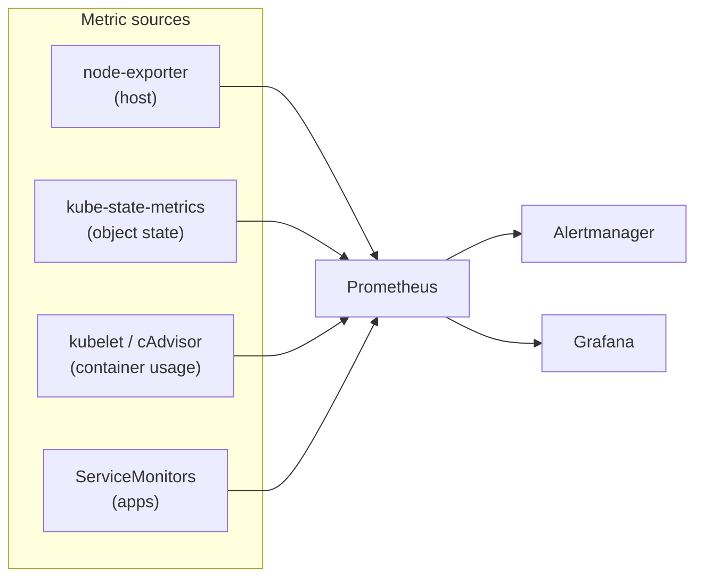
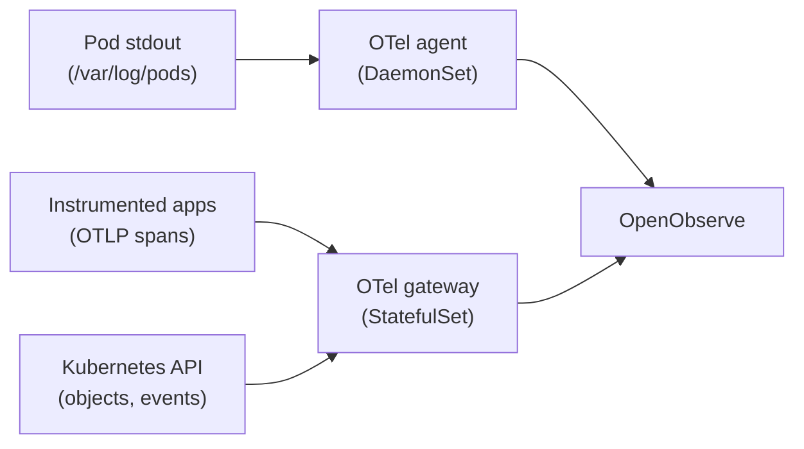

# Monitoring in KubeAid

KubeAid observability has three layers, each with a single owner:

| Layer | Signal | Owner |
| ----- | ------ | ----- |
| **Metrics and alerting** | metrics, alerts | `kube-prometheus` (Prometheus, Alertmanager, Grafana) |
| **Logs and traces** | logs, traces, Kubernetes events | OpenTelemetry Collector → OpenObserve (default) |
| **Runtime security** | process, file, network events | Tetragon or KubeArmor → OpenObserve |

The guiding rule:

> **Metrics live only in kube-prometheus.** OpenObserve stores logs, traces and
> events — it never ingests infrastructure metrics, and it is never the alerting
> engine. Prometheus is the single source of truth for metrics.

Per-stack setup is documented in each application's Helm chart README (linked below).

## Where to look: there are two UIs, not one

This is the trade-off to understand before adopting the stack.

| Signal | Where you look |
| ------ | -------------- |
| Metrics, alerts, dashboards | **Grafana** (Prometheus datasource) |
| Logs, traces, Kubernetes events, security events | **OpenObserve's own UI** |

**Grafana has no OpenObserve datasource.** Its datasource list is defined in
`build/kube-prometheus/common-template.jsonnet` and contains Prometheus only. The
community OpenObserve plugin is not in the Grafana plugin catalog and is unsigned, so
loading it would require `allow_loading_unsigned_plugins` — a deliberate security
downgrade for a plugin with little maintenance activity. KubeAid does not ship it.

You therefore pivot between the two UIs manually, by trace ID or timestamp. In exchange,
no data is duplicated between the backends and each signal stays in the store that is
actually good at it.

If a single Grafana pane is a hard requirement, the only supported route is
Grafana-native backends (Loki for logs, Tempo for traces) — which KubeAid does not
default to, having deprecated `loki-stack`.

## Metrics: kube-prometheus

[kube-prometheus](https://github.com/prometheus-operator/kube-prometheus) is the metrics stack. It provides:

- **Prometheus** — scrapes ServiceMonitors, PodMonitors and exporters across the cluster
- **Alertmanager** — routes metric alerts to notification channels
- **Grafana** — dashboards
- **node-exporter** — node/host CPU, memory, disk and network
- **kube-state-metrics** — Kubernetes object state (replica counts, pod phases, conditions)
- **kubelet / cAdvisor** — per-pod and per-container resource usage

Those three exporters cover every metric dimension in the cluster, which is why
the OpenTelemetry Collector does not collect metrics (see below).

Configuration is managed per cluster via Jsonnet (`<cluster-name>-vars.jsonnet`) and built into
Kubernetes manifests. See [Prometheus Configuration](./kubeaid/prometheus-configuration.md).



### How metrics get in: Prometheus pulls, it is not pushed to

Every metric in the cluster reaches Prometheus by **scraping** — Prometheus opens the
connection and fetches `/metrics` from the target. Nothing pushes metrics to it.

Pull is the better default whenever the data can be served from an endpoint:

- **A failed scrape is itself a signal.** Prometheus sets `up == 0` when a target does not
  answer, which is the cheapest liveness alert you have. With push, silence is ambiguous —
  a healthy quiet app and a dead one look identical.
- **Prometheus controls the rate**, so a misbehaving target cannot flood it.
- **The target stays dumb** — no queue, no retry, no buffering inside the application.
- **It is debuggable by hand** — `curl` the endpoint and see exactly what Prometheus sees.

Prometheus also supports `remote_write` (a *push* endpoint), and the Jsonnet exposes it as
`prometheus.remoteWriteReceiver`. It is **off by default and unused**. Push is only the right
answer for data that has no endpoint to scrape — see
[application metrics](#application-metrics-from-auto-instrumentation) below.

> A naming trap worth knowing: in the OpenTelemetry Collector, a **receiver** means "an
> input", not "something that waits". The `otlp` receiver waits to be pushed to, but the
> `prometheus` receiver **dials out and scrapes**. Same category, opposite direction.

### Why metrics are not moved to the log backend

Several log backends, OpenObserve included, can also store metrics and evaluate alerts, which
raises the obvious question of why KubeAid does not consolidate on one system. The answer is
that kube-prometheus is not merely a metrics database — it is the alerting and dashboard
corpus, and in this repository that corpus is large:

- **~2,170 alert definitions** and **~350 Grafana dashboards** come free from the vendored
  Jsonnet mixins (Kubernetes, node-exporter, etcd, Ceph, cert-manager, Argo CD, Velero,
  OpenSearch, RabbitMQ, OpenCost and more), and they track upstream.
- **~70 charts** ship a `ServiceMonitor` or `PodMonitor`. Those become inert the moment
  prometheus-operator is removed, so scraping would have to be re-plumbed for every one.
- **Alertmanager** provides silences, inhibition, grouping and routing — the layer the
  on-call path depends on.
- **prometheus-adapter** serves custom metrics to the HPA.

Replacing it means rewriting all of that in another query dialect and maintaining it by hand
forever. Prometheus is also CNCF-graduated and vendor-neutral, which makes it the most
portable component in the stack — the opposite of a good thing to trade away for a single
vendor's product.

## Logs and traces: OpenTelemetry → OpenObserve

Collection is done by the **OpenTelemetry Collector**, deployed by the
[opentelemetry-operator](../argocd-helm-charts/opentelemetry-operator) from
`OpenTelemetryCollector` custom resources. The operator itself is a controller — it
does not handle telemetry. It renders two collectors:

| Collector | Workload | Responsibility |
| --------- | -------- | -------------- |
| **agent** | DaemonSet (one per node) | tails container logs from `/var/log/pods` and ships them over OTLP |
| **gateway** | StatefulSet | receives OTLP traces from applications, watches Kubernetes objects/events, builds the service map |

Because collection is OpenTelemetry-native, the storage backend is a configuration
change rather than a re-instrumentation.



### Logs

The agent DaemonSet tails every pod's stdout, enriches each record with Kubernetes
metadata (namespace, pod, labels, node) and exports it to OpenObserve over OTLP.
Nothing needs to be configured per application — anything a container writes to
stdout is collected.

### Traces

Traces are **pushed by the application**, not scraped. The OpenTelemetry Operator
provides `Instrumentation` custom resources for Java, Python, Go, .NET and Node.js;
annotating a pod injects auto-instrumentation with no code change:

```yaml
metadata:
  annotations:
    instrumentation.opentelemetry.io/inject-java: "true"
```

Spans are sent to the gateway, which exports them to OpenObserve. The gateway also runs the
**servicegraph** connector, which derives a service map (service-to-service topology and RED
metrics) from those traces.

Servicegraph is the one metrics stream OpenObserve keeps, and it is a deliberate exception.
It is *derived from* the traces rather than scraped from anywhere — there is no `/metrics`
endpoint Prometheus could pull it from — and it is viewed in the same UI, right next to the
traces it was built from. Moving it to Prometheus would split the tracing experience across
two tools to satisfy a rule it does not really violate.

### Application metrics from auto-instrumentation

Worth knowing before you annotate a workload: the OpenTelemetry SDK injected by an
`Instrumentation` resource emits **metrics as well as traces**, and sends both to the same
OTLP endpoint. KubeAid keeps the traces. It does **not** collect the OTLP metrics — the
gateway has no metrics pipeline for them, so they are discarded at the collector.

This is intentional rather than accidental: metrics belong to Prometheus, and Prometheus
collects by scraping. **To get an application's metrics into Prometheus, expose a `/metrics`
endpoint and add a `ServiceMonitor`** — the convention every chart in this repository already
follows. Annotating for auto-instrumentation gives you traces; it does not give you metrics.

The alternative is to route the OTLP metrics into Prometheus instead of discarding them, by
adding a `prometheusremotewrite` exporter to the gateway and enabling
`prometheus.remoteWriteReceiver` on the Prometheus side. That is the one case where pushing
metrics is correct — an SDK-instrumented application never serves an endpoint, so there is
nothing to scrape. It is not enabled by default.

### Why there are two collectors

The agent and the gateway are the same binary in different deployment modes, and the split
is not arbitrary:

- The **agent** must be a DaemonSet because its inputs are **node-local**: log files only
  exist on the node that wrote them.
- The **gateway** must be central because its inputs are **cluster-wide**:
  - `k8sobjects` watches the Kubernetes API. On a DaemonSet, every node would open its own
    watch and emit a duplicate copy of every event.
  - `servicegraph` must see **both sides** of a call — the client span and the server span —
    to draw an edge. Those pods usually sit on different nodes, so a per-node collector
    structurally cannot build the graph.
  - It is the single egress point to the backend, so retries, queueing and backpressure are
    handled in one place rather than on every node.

The rule of thumb: **if it reads the node, it belongs to the agent; if it needs a
cluster-wide view, it belongs to the gateway.**

### Why the collector does not collect metrics

The upstream collector chart can scrape host and container metrics (`hostmetrics`,
`kubeletstats`, a `prometheus` receiver) and ship them to OpenObserve. KubeAid disables
all of these: they duplicate node-exporter, kubelet/cAdvisor and kube-state-metrics,
doubling collection cost and storage for data Prometheus already owns.

These are switched off from the **wrapper** chart values
(`argocd-helm-charts/openobserve/values.yaml`), not by editing the vendored subchart —
see [Configuring vendored charts](#configuring-vendored-charts).

## Log backend options

OpenObserve is the default. Two alternatives are supported for clusters that need them.

| Option | Notes | Licence | Chart |
| ------ | ----- | ------- | ----- |
| **OpenObserve** (default) | Logs, traces and events in one backend; Parquet on object storage | AGPL-3.0 core; Enterprise image adds SSO/RBAC/audit | [openobserve](../argocd-helm-charts/openobserve/README.md) |
| **OpenSearch + Dashboards** | ELK-style search; the fully permissive option | Apache-2.0 (SSO/RBAC included) | [opensearch](../argocd-helm-charts/opensearch/README.md) |
| **Graylog** | Log collection and management | — | [graylog](../argocd-helm-charts/graylog/README.md) |

Log shipping for OpenSearch and Graylog uses [fluent-bit](../argocd-helm-charts/fluent-bit)
or the OpenTelemetry Collector.

### A note on OpenObserve licensing

OpenObserve ships in two forms, and the choice has consequences worth making deliberately.

| | OSS | Enterprise |
| --- | --- | --- |
| Licence | AGPL-3.0, source available | Commercial, closed-source binary from the vendor's registry |
| Cost | Free, unlimited ingestion | Free below an ingestion ceiling; commercial licence above it |
| SSO / RBAC / audit | Not included | Dex SSO, OpenFGA RBAC, audit trail |

KubeAid currently sets `enterprise.enabled: true`, so SSO and RBAC work out of the box.

**If you need an auditable, fully self-contained stack, prefer the OSS image**
(`enterprise.enabled: false`) and put authentication in front of it at the ingress with
[traefik-forward-auth](../argocd-helm-charts/traefik-forward-auth) or oauth2-proxy, backed
by Dex. That recovers SSO without a closed-source binary, an ingestion ceiling, or a
commercial agreement — all three of which are in the vendor's control rather than yours.

Two limits to be aware of before choosing that path:

- Forward-auth authenticates **at the ingress**. It does not give you RBAC *inside*
  OpenObserve, so everyone who gets through the door sees everything in that instance.
  KubeAid deploys OpenObserve per cluster, so isolation between clusters is physical and
  this is usually acceptable — but it is not a substitute for in-product RBAC if you need
  to partition access *within* one cluster's data.
- AGPL-3.0 is copyleft. That is normally fine for internal operational use, but it should be
  a conscious decision, not a surprise.

Review the current Enterprise terms directly with the vendor before relying on the free
tier — the ceiling, the telemetry requirements and the termination conditions are set by
them and can change.

Clusters that need free in-product SSO/RBAC at any volume, or that cannot take a copyleft or
commercially licensed binary at all, should use **OpenSearch**, which is Apache-2.0
throughout.

### Deprecated log charts

| Chart | Replacement |
| ----- | ----------- |
| [filebeat](../argocd-helm-charts/filebeat/README.md) | OpenTelemetry Collector, or [fluent-bit](../argocd-helm-charts/fluent-bit) |
| [loki-stack](../argocd-helm-charts/loki-stack/README.md) | OpenObserve |

Both are marked `deprecated: true` and remain only for existing clusters.

## Runtime security events

Runtime security is a separate layer from application telemetry, but its events land in the
same backend. Both tools run as a DaemonSet and use eBPF; pick one per cluster.

| Chart | Strength | Enforcement |
| ----- | -------- | ----------- |
| [tetragon](../argocd-helm-charts/tetragon/README.md) | Security **observability** — process, file and network events with process ancestry. Pairs with the Cilium CNI. | `SIGKILL` after detection |
| [kubearmor](../argocd-helm-charts/kubearmor/README.md) | **Inline enforcement** — denies an operation at the LSM hook before it runs; least-privilege hardening | LSM (AppArmor, BPF-LSM, SELinux) |

Both ship as observability-only by default (Tetragon has no `TracingPolicy`; KubeArmor's
postures are `audit`), so nothing is blocked until you opt in. Both write their events to
stdout, so the OpenTelemetry agent DaemonSet already collects them into OpenObserve — no
extra configuration is required.

## Alerting strategy

- **Metric alerts** — Prometheus rules, evaluated by Prometheus, routed by **Alertmanager**. This is the only alerting path for infrastructure health.
- **Log alerts** — evaluated by the log backend (OpenObserve, Graylog or OpenSearch).

Both signals converge on the **on-call bridge** rather than on each other: Alertmanager
forwards metric alerts to it, and a log backend that can raise alerts posts to it directly by
webhook. The bridge is the single funnel to on-call.

The consequence is that **suppression must live in the bridge, not in Alertmanager**.
Alertmanager's silences and inhibition rules only apply to alerts that pass through it, so
silencing a node there will not stop a log alert about the same node. Maintenance windows,
deduplication and silencing therefore belong in the on-call bridge, where both sources meet.

Metrics tell you that something is unhealthy; logs and traces explain why; security events
tell you what ran.

## Known gaps

Recorded so they are not rediscovered the hard way.

**The collector is not monitored.** The `openobserve-collector` chart ships no
`ServiceMonitor` or `PodMonitor`, so nothing scrapes the collector's own telemetry
(`otelcol_exporter_send_failed_*`, `otelcol_processor_dropped_*`, queue depth). If the agent
starts dropping records — a full queue, a rejecting backend, a failing export — the logging
pipeline degrades **silently**, with no alert. The component that ships all the logs is the
one component nothing watches.

**Alertmanager is not reachable from inside the cluster's other namespaces.** Its
NetworkPolicy (`build/kube-prometheus/common-template.jsonnet`) allowlists ingress on port
9093 from exactly two sources: Traefik, and the kubeaid-agent in the `obmondo` namespace.
This is not a problem for the alerting flow above — log alerts leave the cluster by webhook
rather than entering Alertmanager — but anything that *does* need to POST to
`/api/v2/alerts` will be dropped until an ingress rule is added for it.

## Configuring vendored charts

Charts under `argocd-helm-charts/<app>/charts/` are **vendored upstream** and must not be
edited: re-vendoring the upstream chart discards local changes. Configure them from the
first-layer wrapper values instead — `argocd-helm-charts/<app>/values.yaml` — keyed by the
subchart name. Setting a key to `null` removes the upstream default during Helm value
coalescing.

```yaml
openobserve-collector:
  agent:
    receivers:
      hostmetrics: null      # removes the upstream receiver
```

## Further reading

- [Prometheus Configuration](./kubeaid/prometheus-configuration.md) — kube-prometheus setup and Jsonnet build
- [Prometheus Namespaces](./operations/monitoring/prometheus-namespaces.md) — namespace scrape scope
- [Pod Autoscaling](./operations/monitoring/pod-autoscaling.md) — HPA with custom metrics from Prometheus
- [OpenObserve Collector reference](../argocd-helm-charts/openobserve/charts/openobserve-collector/docs/README.md)
